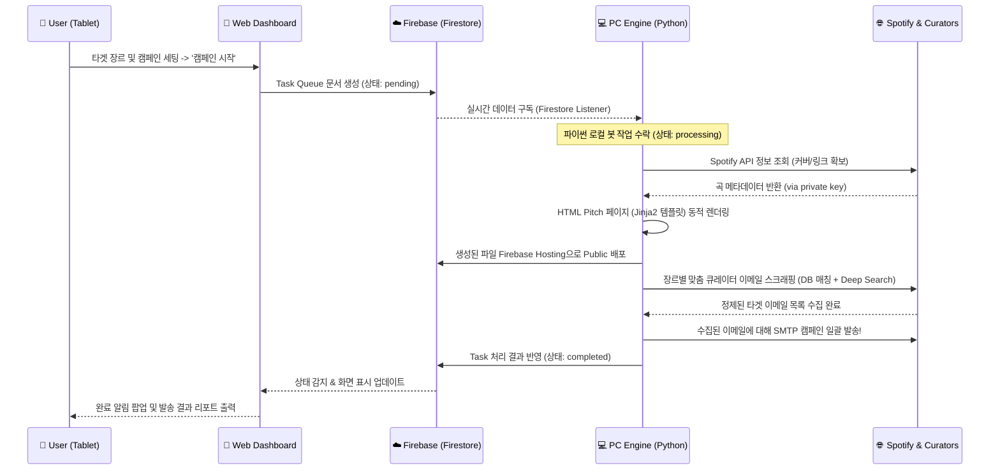

# 🎵 Spotify Music Promoter Ecosystem

**Spotify Music Promoter**는 인디 뮤지션 및 기획사를 위해 설계된 **통합 뮤직 프로모션 대시보드 및 자동화 마케팅 솔루션**입니다.
발매된 곡을 전 세계 음악 블로그, 플레이리스트 큐레이터, 리뷰 매체에 손쉽게(Pitch) 보내고 홍보할 수 있는 올인원 툴입니다.

---

## 🎯 **프로젝트 목표 (Project Goals)**

1. **자동화된 큐레이터 리서치**: 수작업으로 찾던 큐레이터/블로거 이메일을 장르 기반으로 자동 수집하여 시간을 90% 이상 절약.
2. **원클릭 Pitch 페이지 생성**: 각 캠페인마다 고유의 음악 청취용 소개(Pitch) 페이지를 자동으로 생성·배포.
3. **태블릿 & PC 유연한 연동**: 언제 어디서나 태블릿(React Web)으로 간편하고 직관적으로 캠페인을 제어하고, 무거운 백엔드 작업(크롤링/메일 발송/API 검색 등)은 데스크탑PC 쪽에 설치된 파이썬 엔진(Bridge)이 분담 처리하는 구조.
4. **대량 메일 자동화**: 수집된 큐레이터 목록으로 일괄 프로모션 이메일 전송을 자동화.
5. **보안성 최적화**: API 키(Spotify) 및 프로모션 핵심 자산(큐레이터 이메일 DB)은 GitHub이나 프론트엔드로 배포되지 않도록 격리하여 로컬 백엔드에서만 사용.

---

## 🏗️ **아키텍처 구조 (System Architecture)**

본 프로젝트는 Frontend(Web Dashboard)와 Backend(Local PC Engine) 사이를 Cloud(Firestore)가 브릿지로 연결해주는 하이브리드 아키텍처를 채택했습니다.

1. **Web Dashboard (Frontend)**
    - React 기반으로 태블릿 및 모바일 기기에 최적화된 컨트롤 화면 제공.
    - 캠페인 설정, 진행 상태 모니터링, 작업 스케줄링 (Firestore에 작업 요청 업로드).

2. **Cloud Bridge (Firebase)**
    - Firestore 데이터베이스를 이용해 Frontend의 명령을 Backend 엔진으로 실시간 중계하는 파이프라인.
    - 생성된 Pitch 페이지는 외부인과 큐레이터들이 접속할 수 있도록 Firebase Hosting 을 거쳐 안전하게 제공.

3. **PC Engine (Backend / Python)**
    - `pc_bridge.py`: 클라우드에서 내려온 Task를 실시간 감지하여, 스크랩, API 조회, 렌더링 등의 작업을 실행하는 핵심 처리 모듈.
    - Python 기반으로 작동하며 병목이 발생하는 프로세스(대량 파일 I/O 및 검색/이메일 발송 등)를 PC 리소스로 해결.
    - **중요**: 시크릿 키 관리용 `private_keys.py`, 이메일 코어 수집용 `private_core.py`를 통해 기밀성은 안전망 안에 두고 별도 처리.

---

## 💻 **기술 스택 (Tech Stack)**

- **Frontend**: `React 18`, `TypeScript`
- **Backend**: `Python 3.10+`, `Requests` / `BeautifulSoup` (웹 스크래핑 엔진), `Jinja2` (HTML Pitch 동적 생성 엔진)
- **Data & Auth**: `Google Firebase` (Firestore DB, Hosting)
- **External API & Libs**: `Spotify Web API`, `Pydub` (오디오 프로세싱)

---

## 📈 **동작 플로우 차트 (Flowchart)**

